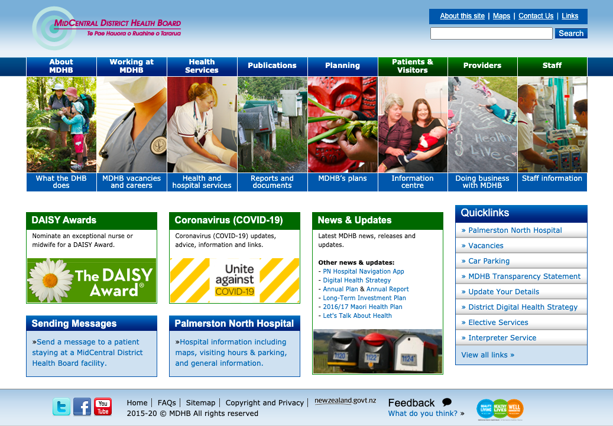

---  
    posttype: blog
    slug: midcentral-district-health-board
    date: 2020-10-21
    category: Accessibility
    addtohomepage: false
    title: MidCentral District Health Board
    coverimage:
    intro: The MidCentral District Health Board website1 has accessibility issues from a visual design and HTML mark-up perspective.
---

<h3>Public site with Accessibility Web Standards</h3>

The MidCentral District Health Board website1 has accessibility issues from a visual design and HTML mark-up perspective.

<figure></figure>

This webpage has no mobile first strategy to provide for mobile device usage, of which dominates at around 51.5% of global traffic.2

When using [axe](https://www.deque.com/axe)3 for chrome, 78 accessibility issues were found.

**Input fields** 
The search input field does not have a required label to allow screen readers to voice the input prompt for the user. The Label should describe in sufficient detail what input is required from the user.

**Links** 
There are multiple links that contain images. Neither the links have text, titles or aria-labels that are visible for screen readers and images are missing alt text. The default semantics of the link are not overridden with the role of 'presentation' or 'none'.

**Landmarks** 
The document has no main landmark and content is not contained by any landmarks. A main landmark will provide a navigation point to the primary content of the page for users of assistive technologies. Content contained within landmarks will allow a user to navigate to a section based on the landmark.

**Headings** 
There is no Level 1 heading. Screen reader users can use shortcuts to navigate directly to the first h1, which, in principle, should allow them to jump directly to the main content of the web page.
Considering this is a New Zealand Government funded website that is associated with access to health care, this organisation should evaluate their website strategy and consider accessibility for assistive technologies and the implementation of current HTML5 mark-up.

**References** 
1.	MidCentral District Health Board. Retrieved from http://www.midcentraldhb.govt.nz/
2.	Statista. Percentage of mobile device website traffic worldwide from 1st quarter 2015 to 2nd quarter 2020. Retrieved from https://www.statista.com/statistics/277125/share-of-website-traffic-coming-from-mobile-devices/ https://www.statista.com/statistics/277125/share-of-website-traffic-coming-from-mobile-devices/
3.  axe: Accessibility Testing Tools and Software https://www.deque.com/axe

