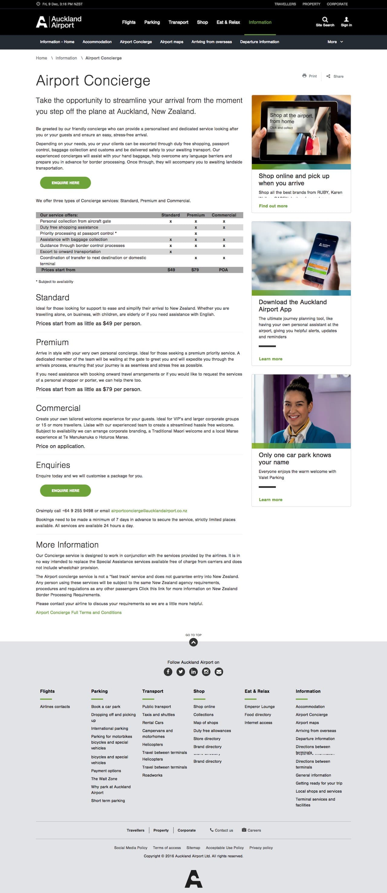
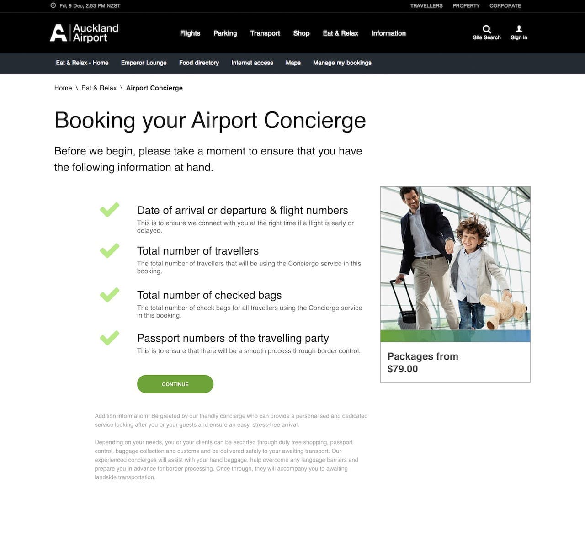
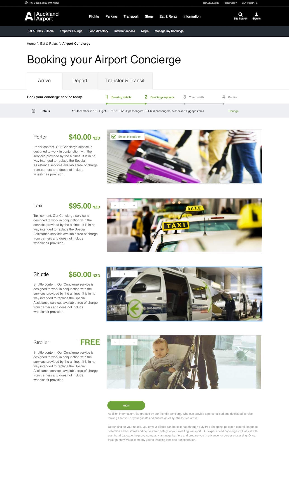
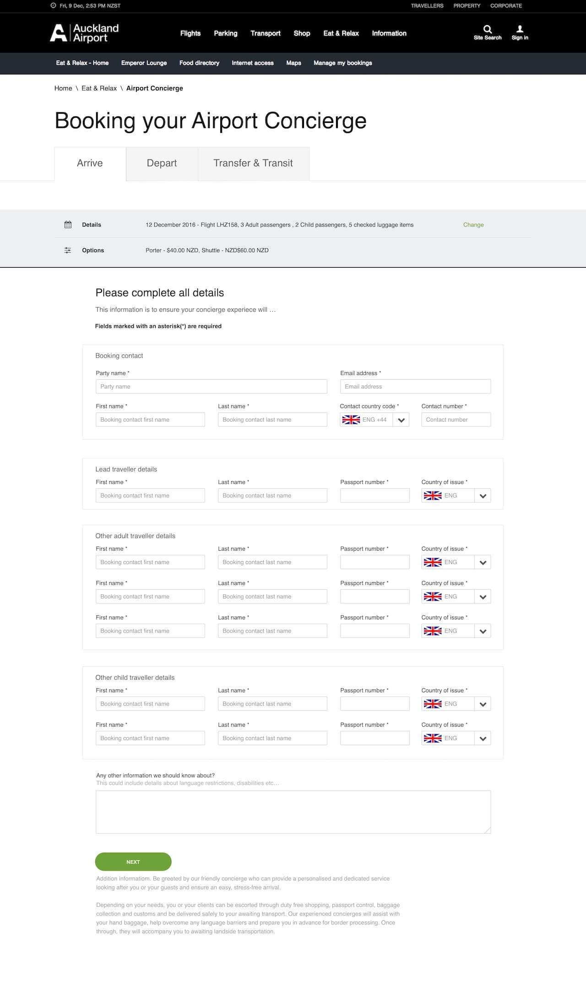

---  
    posttype: project
    slug: auckland-airport
    date: 2017-05-01
    category: Website
    url: http://aucklandairport.co.nz   
    addtohomepage: true
    title: Auckland Airport - Concierge Service
    coverimage: ./thumb@2x.png
    intro: Web design - Wireframes & UI design.
---

Auckland Airport Concierge Service is a module add-on incorporated into their existing website.

I created wireframes, user flows and hi definition designs for stakeholders.

I also worked on the front end, building HTML/LESS templates and defining responsive layouts for the Auckland Airports site redesign.

