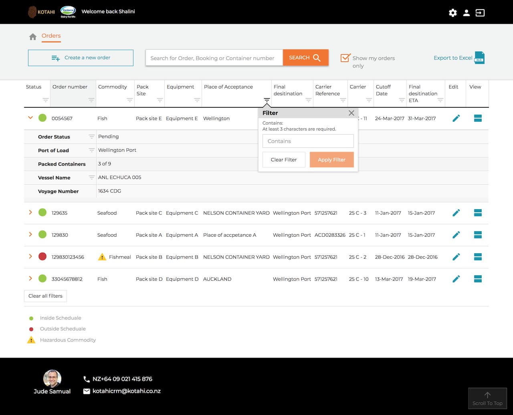
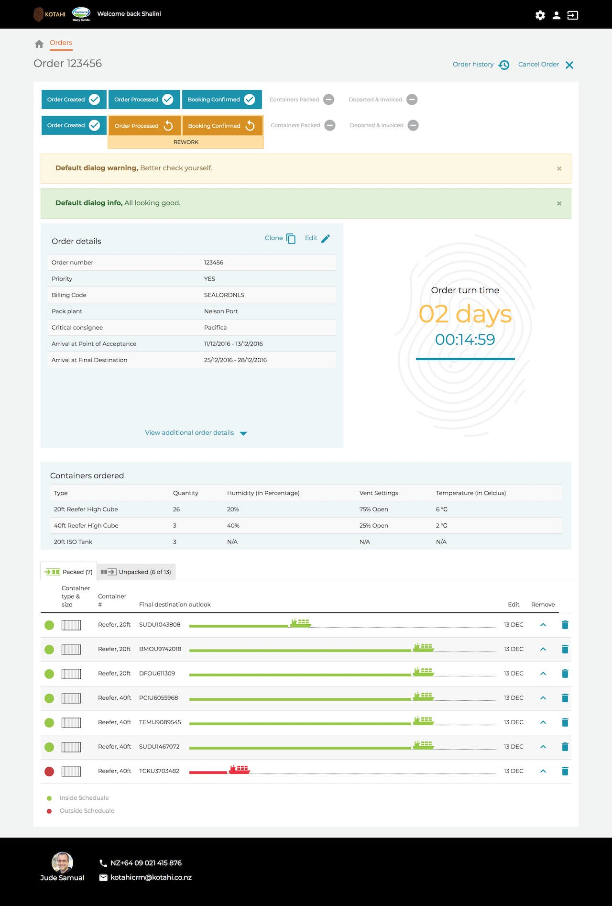
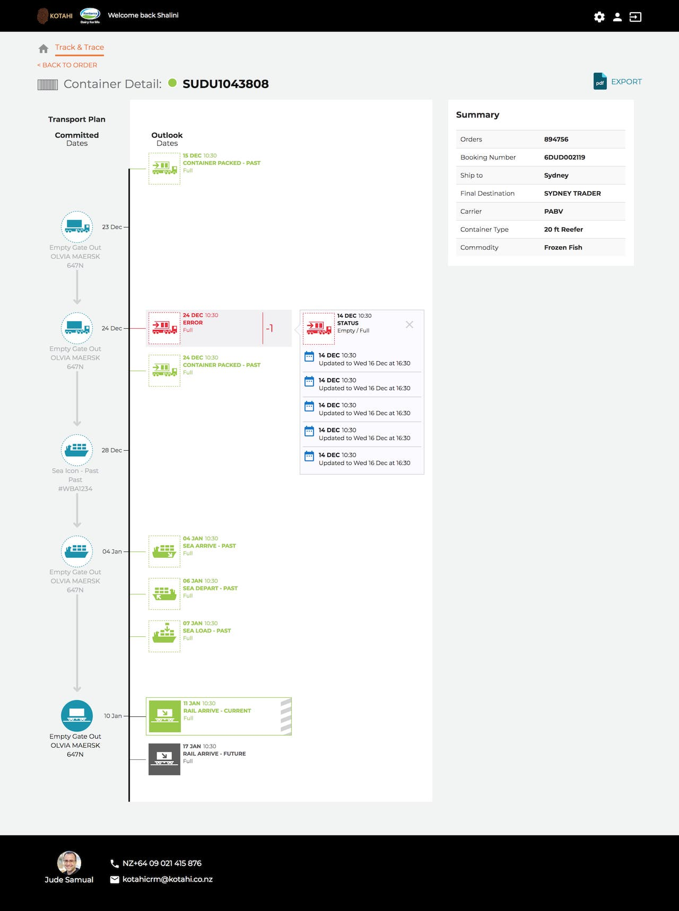

---  
    posttype: project
    slug: kotahi
    date: 2017-10-01
    category: Website application
    url: http://kotahi.com
    addtohomepage: true
    title: Kotahi - Web application
    coverimage: ./thumb@2x.png
    intro: Web application. UI Design, HTML prototypes & templates.
---

Implemented a UI design refresh across legacy pages.

I designed and built web app pages, flow and components. Designed, built and managed pattern library and HTML component library.

