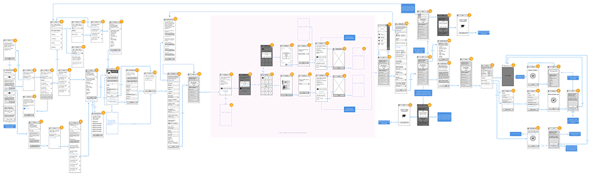
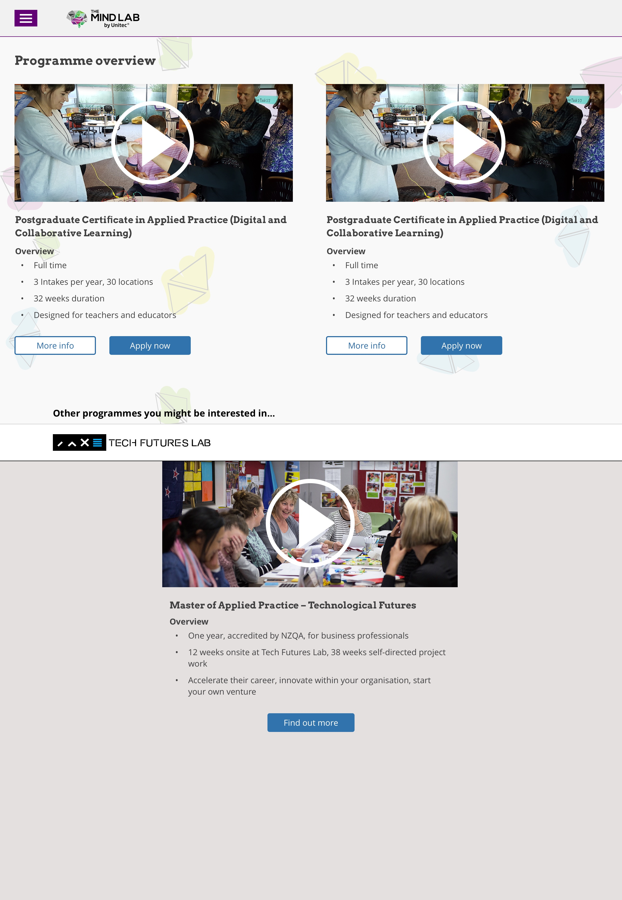
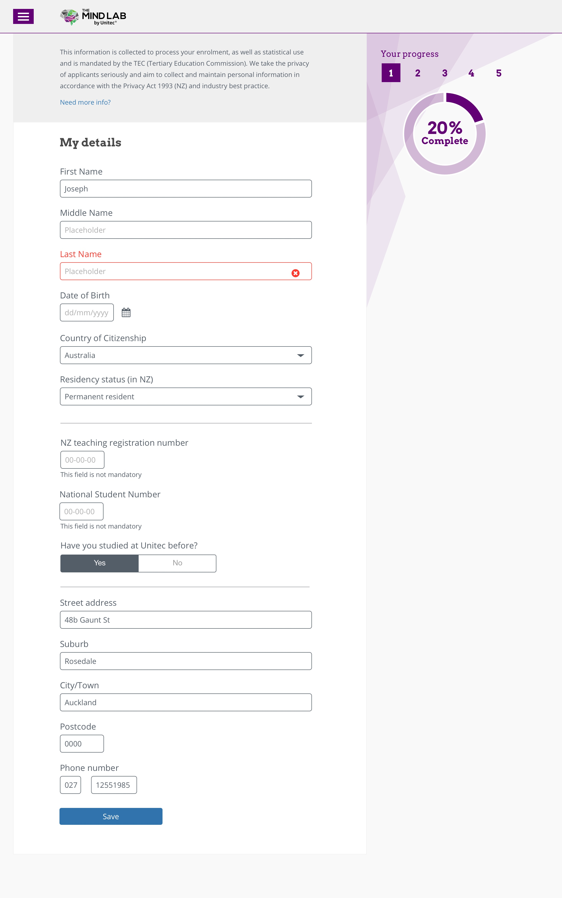
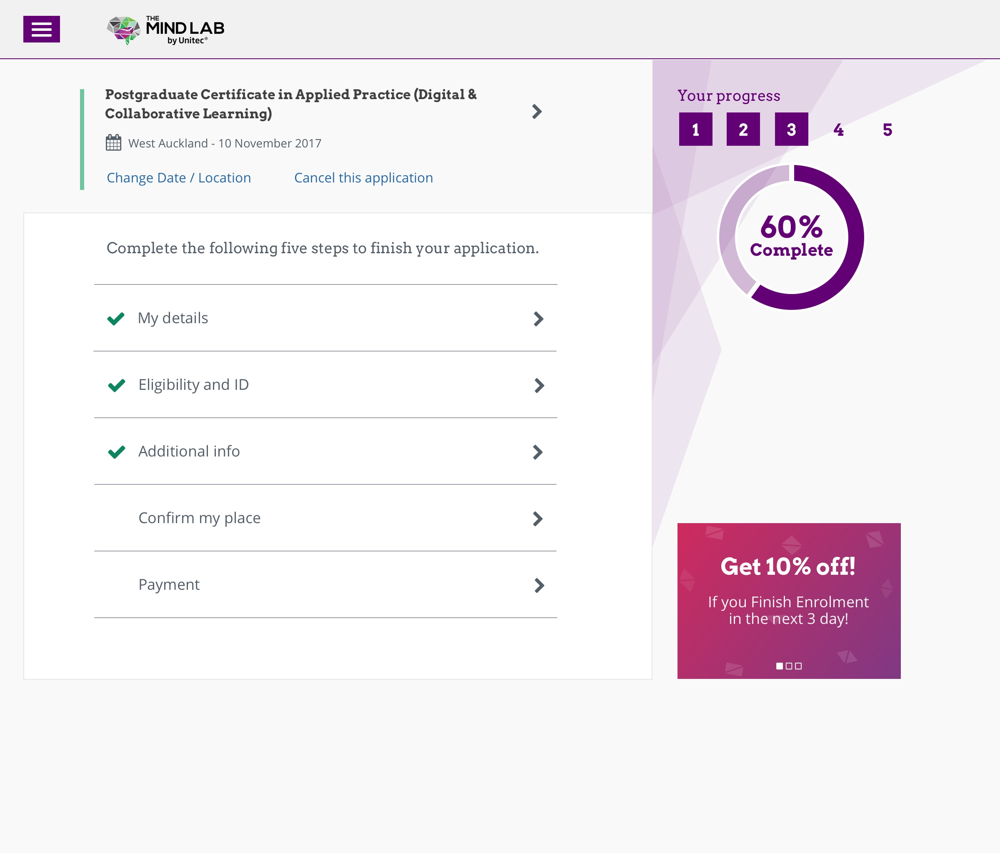

---  
    posttype: project
    slug: the-mind-lab
    date: 2017-12-01
    category: Website
    url: http://themindlab.com
    addtohomepage: true
    title: The Mind Lab/Tech Futures Lab - Course enrolment 
    coverimage: ./thumb@2x.jpg
    intro: User flow, wireframes, UI design, style guide & prototype.
---

The Mind Lab and Tech Futures Lab is a business and technology accelerator for students and professionals.

I created the user flows & wire-frames and hi definition designs for course enrolment module.

