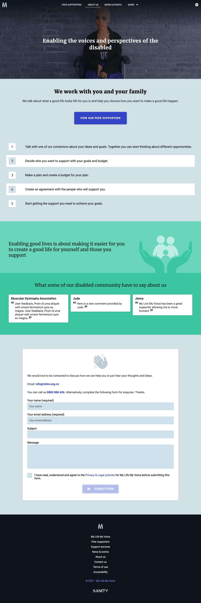
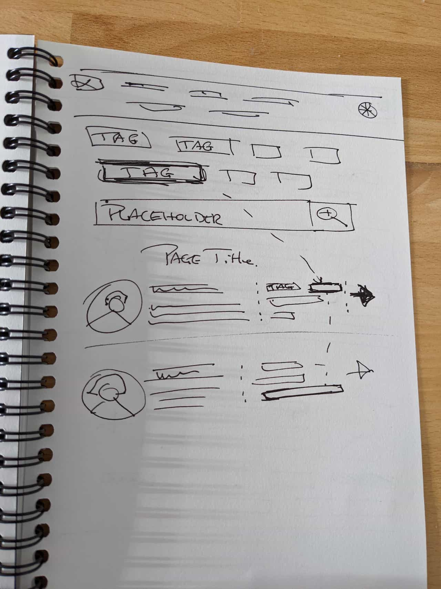
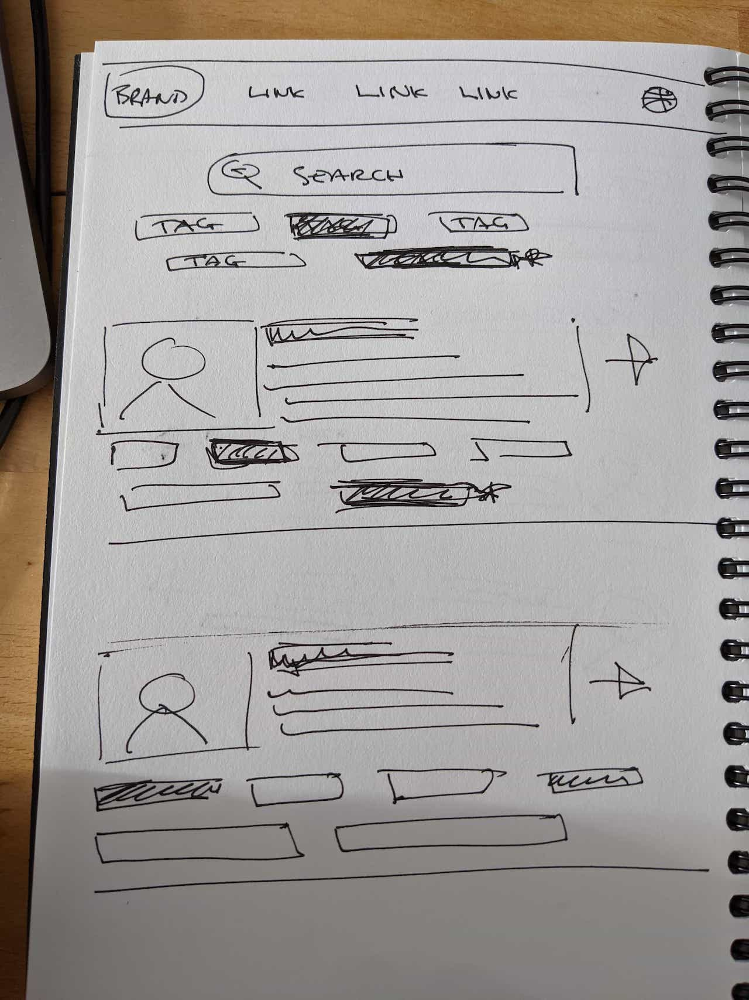
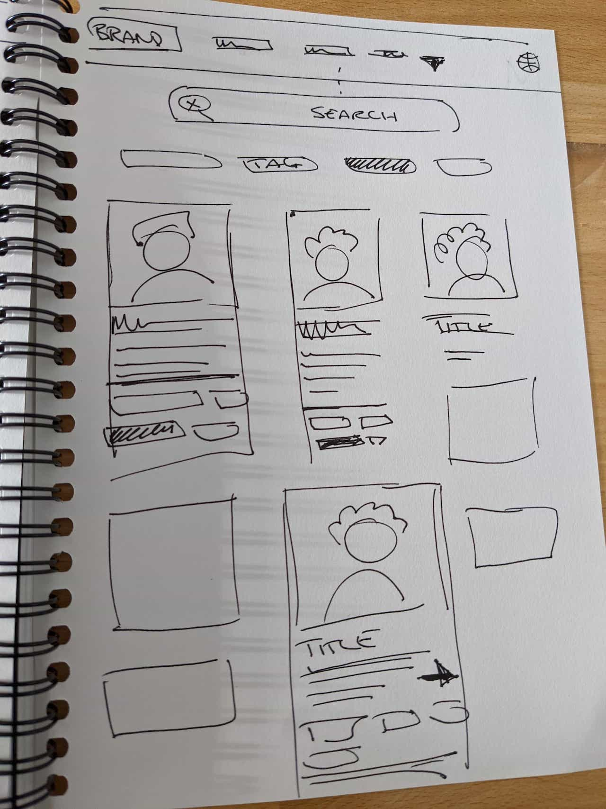
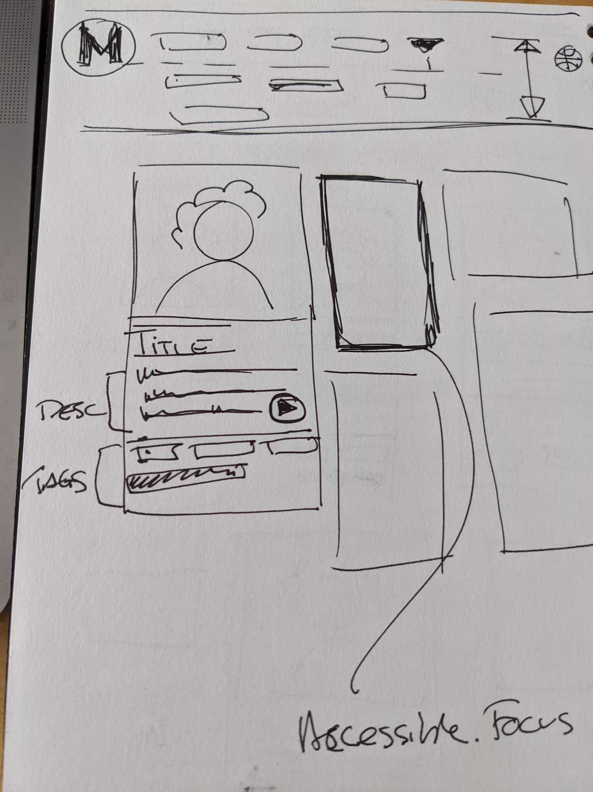
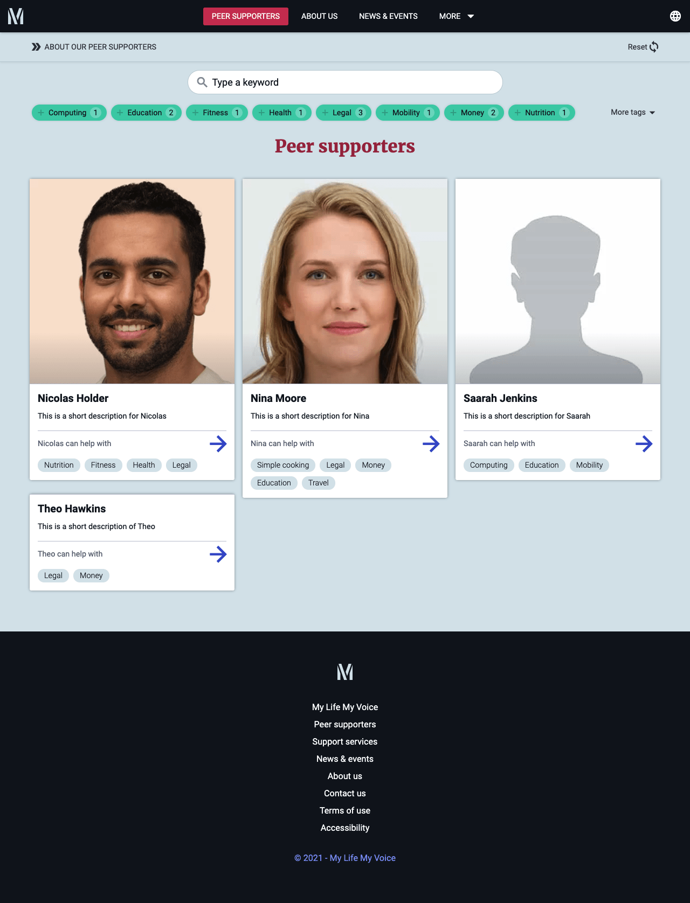
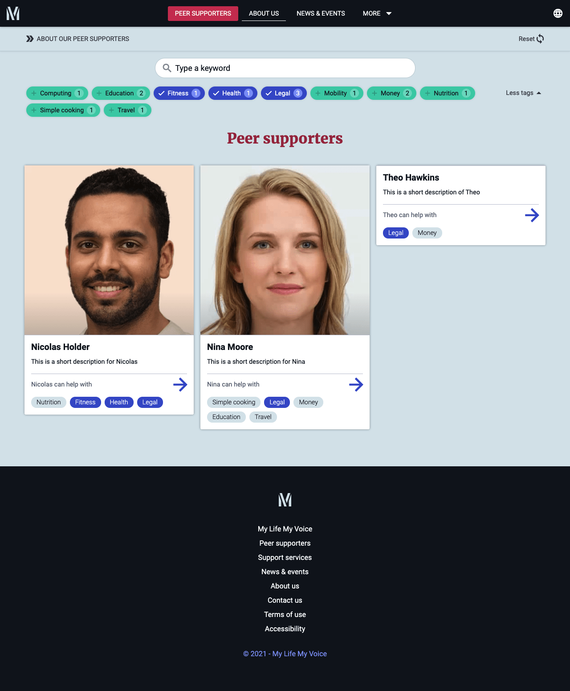
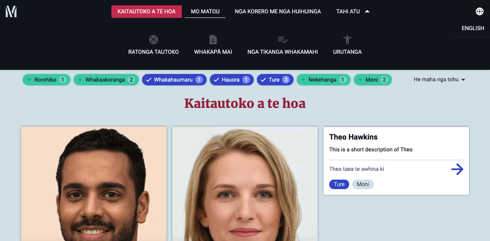

---  
    posttype: project
    slug: mlmv
    date: 2021-01-01
    category: Website & Progressive Web App
    url: https://dev-mlmv.netlify.app
    addtohomepage: true
    title: My Life My Voice
    coverimage: ./homepage-1.0.png
    intro: A website for the disabled community. Accessible & multilingual.
---

**Project** 
A website for the disabled community. Connecting experienced Peer supporters to individuals with physical impairments to help them achieve their goals. The client requested an accessible and multilingual (full translations) website which would be easy to update, manage and scale.

**Challenges** 
The key challenge for me with this project was to implement locale and internationalisation. Sanity CMS offers the option to implement languages manually. The solution allows fall back to the default language and has clear documentation. Learning to implement internationalisation through templates was a steep yet rewarding curve. There are JSON files for short translations and shared components, also internationalisation is passed to key metadata.

**Benefits** 
As a JAMstack solution, the current bandwidth usage translates to zero hosting costs and has a high Lighthouse score. Sanity also offers a non-profit tear which I took advantage of saving the client on API call charges. The structure allows the client to scale as they need and not pay unnecessary costs. Internationalisation has its benefits from a users perspective and can help to clarify key messaging to target groups.

**The experience** 
Although the site is not live yet and content is being developed, the feedback is that it is quick, clear and straightforward to use, find relevant supporter(s), services, events and clear keyboard navigation.

**Stack** 
Gatsby (React, HTML, SCSS & API's) and Sanity headless CMS. Locale and internationalisation implemented.

