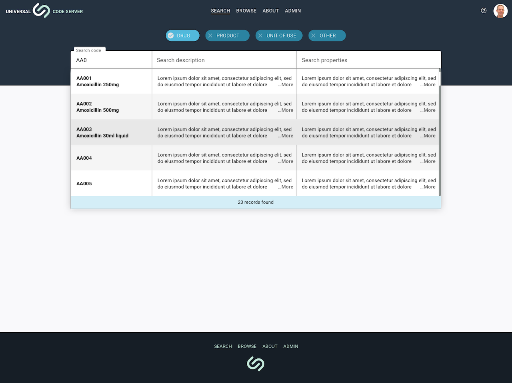

---  
    posttype: project
    slug: sustainable-solutions-ucs
    date: 2020-08-01
    category: Web application
    url: https://sussol.net
    addtohomepage: true
    title: Sustainable Solutions - Universal Code Server
    coverimage: ./sign-in-1.2.png
    intro: Web application for management and distribution of pharmicutical products.
---

**Project** 
A web application for pharmaceutical supply chain software is used in national drug distribution projects, warehouses and hospitals in more than 20 countries around the world. Screen designs are of the search functionality for desktop and mobile.

**Challenges** 
I wanted to implement a Figma pattern library based on the [Material-UI](https://material-ui.com) as the design framework, but there was no appropriate base library to work from at the time. The search wireframe component did feel a little clunky.

**Solution** 
The Material Design Kit for Sketch gave me all the pre-baked symbols and overrides I needed for components, text and colour attributes. Design solutions shared with InVision. The Integration team agreed on setting search types as tags and implementing live search results.

**Tools** 
Sketch, Balsamiq and InVision

 

