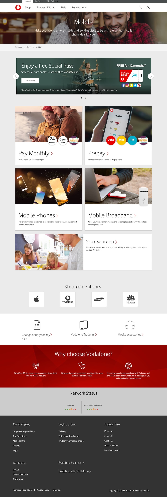
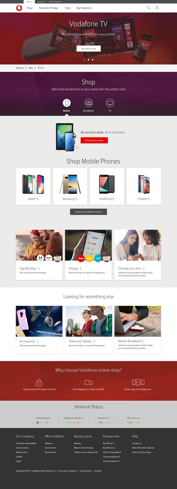
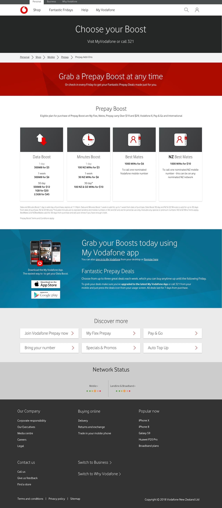
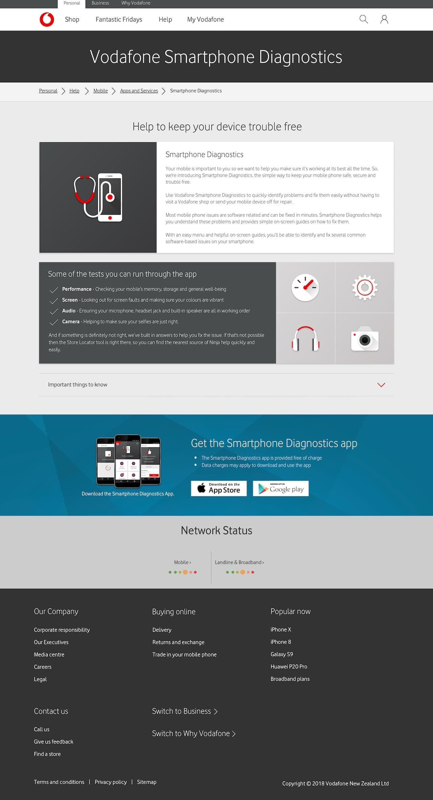

---  
    posttype: project
    slug: vodafone-nz
    date: 2018-08-01
    category: Website
    url: http://vodafone.co.nz
    addtohomepage: true
    title: Vodafone New Zealand
    coverimage: ./thumb@2x.jpg
    intro: UI design refresh of new digital brand guidelines.
---

Implemented a UI design refresh of new digital brand guidelines across legacy pages.

Re-design and rebuild web pages, journeys, components and assets.

I created the designs ensuring brand guidelines are adhered to. Deliverables included design files and components, presented for a range of screen sizing and collaborate with stakeholders.

**Challenges** 
No shared resource for designers to draw from.

**Solution** 
I designed, built and managed pattern library and style guide. Ensured brand and style consistency, allowing the design team to use consistent components from a shared source.

 

 

